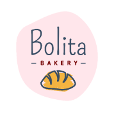

# Bolita Bakery E-Commerce Website

## Description

This is a website for a bakery that sells cookies, brownies, and other baked goods. The website is built using a scalable MongoDB back end, a GraphQL API, and an Express.js and Node.js server with a React front end, implementing user authentication with JWT to build a user-focused platform. This application also utilizes the Stripe API to process payments.

Users can sign up for an account, log in, and add items to their cart. They can also view their order history.

The website is hosted on Heroku.

## Technologies Used

- MongoDB
- Mongoose
- Express.js
- Node.js
- React
- GraphQL
- Apollo Server
- Apollo Client
- JSON Web Token
- Stripe API

## Deployed Application

The application is deployed on Heroku [here](https://bolita-bakery.herokuapp.com/).
